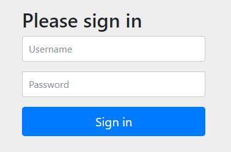
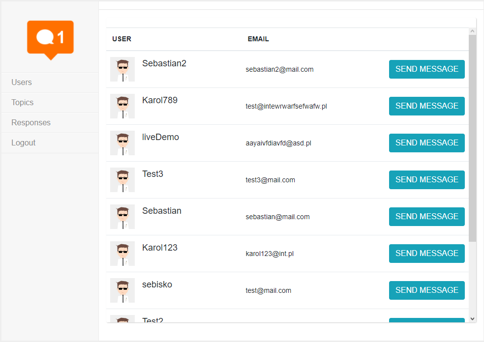
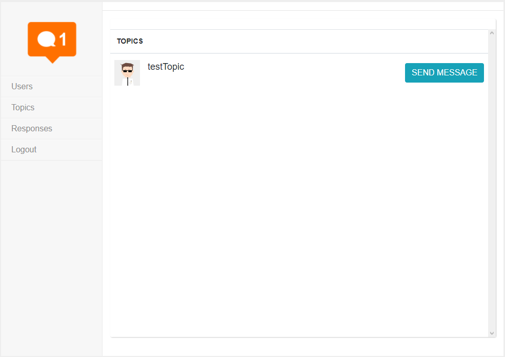
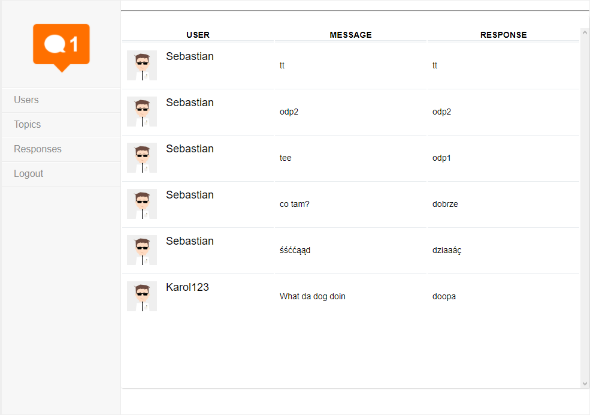
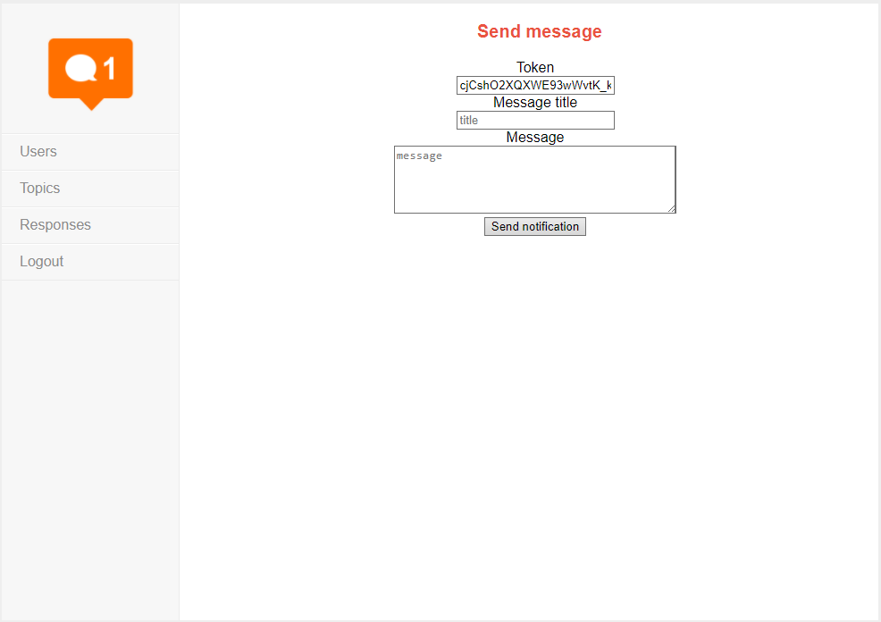
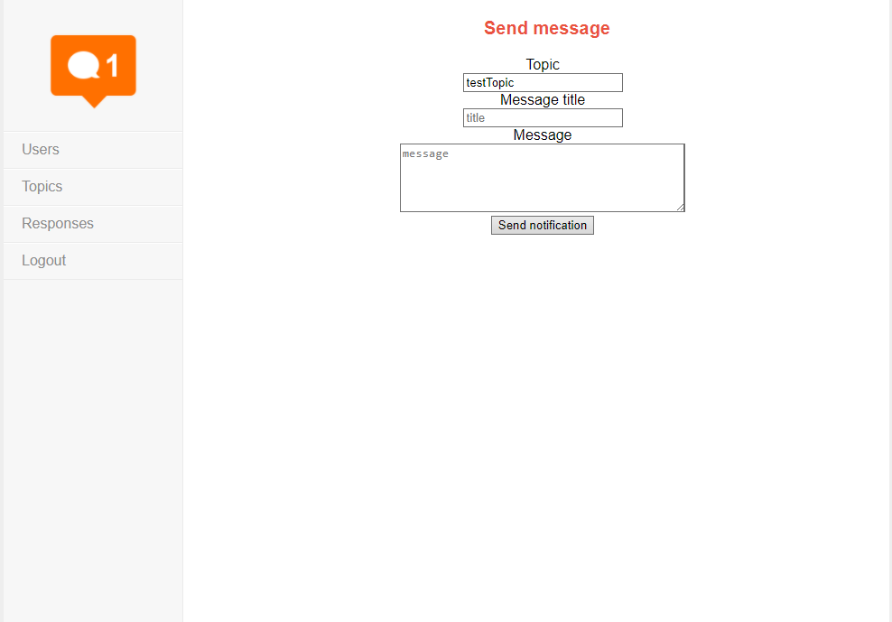
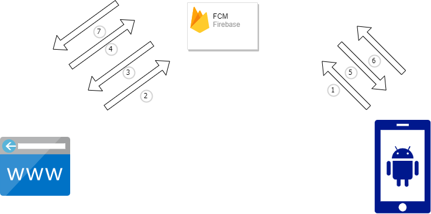

[![MIT License][license-shield]][license-url]

  <h3 align="center">Push Web Application</h3>
  
  

    Aplikacja webowa pozwalająca na wysyłanie powiadomień typu push 
     
    <a href="https://push-web-application.herokuapp.com/">Aplikacja webowa</a>
    ·
    <a href="https://github.com/karolwn/push_app">Aplikacja mobilna</a>

  

<!-- TABLE OF CONTENTS -->

  
Spis treści

  <ol>
    <li>
      <a href="#o-projekcie">O projekcie</a>
    </li>
    <li>
      <a href="#architektura">Architektura</a>
    </li>
    <li><a href="#użyte-technologie">Użyte technologie</a></li>
  </ol>

<!-- ABOUT THE PROJECT -->
## O projekcie
Aplikacja pozwala na wysyłanie powiadomień typu push na telefony z zainstalowaną aplikacją mobilną. Są one wysyłane za pośrednictwem Firebase FCM. Istnieje możliwość wysyłania powiadomień
do konkretnych zarejstrowanych użytkowników oraz do całej grupy osób, która zapisała się do odpowiedniego "topicu". Wysyłając powiadomienia możemy wybrać jego tytuł oraz treść. Za
pośrednictwem aplikacji webowej, możemy też sprawdzać odpowiedzi na konkretne zapytania typu push.

Ekran logowania do aplikacji
 

Widok wszystkich zarejstrowanych użytkowników  

Widok wszystkich grup (wyświetlane są tylko grupy, do których zarejestrowany jest conajmniej jeden użytkownik)  

Widok odpowiedzi nadesłanych przez użytkwoników na dane powiadomienie

Widok formularza do wysyłania wiadomości do konkretnego użytkownika (na konkretny token)  

Widok formularza do wysyłania wiadomości do konkretnej grupy użytkowników (na konkretny topic)  

## Architektura

- 1 - Rejestracja nowego użytkownika
- 2 - Zapytanie o aktualną listę użytkowników/grup
- 3 - Aktualna lista zarejestrowanych użytkowników
- 4 - Wyślij powiadomienie na konkretny token/topic
- 5 - Wysłanie powiadomienia push do użytkownika
- 6 - Zapisz odpowiedź od użytkownika
- 7 - Pobierz listę odpowiedzi

### Użyte technologie
- Java 11
- Spring Boot
- Spring Security
- Thymeleaf
- Firebase FCM

<!-- MARKDOWN LINKS & IMAGES -->
<!-- https://www.markdownguide.org/basic-syntax/#reference-style-links -->

[license-shield]: https://img.shields.io/github/license/othneildrew/Best-README-Template.svg?style=for-the-badge
[license-url]: https://github.com/othneildrew/Best-README-Template/blob/master/LICENSE.txt

